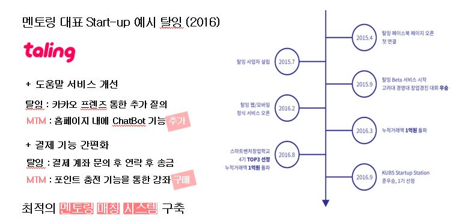

# ManToMen
## 개요
기존의 멘토와 멘티간 튜터링을 연결하는 서비스를 모티브한 튜터링 서비스



## 1. 사전준비
### 1) AWS 사전준비
1. [키페어 생성하기](./doc/create_keypair.pdf)
2. [보안그룹 생성하기](./doc/create_security_group.pdf)
3. [**AWS**에서 (Linux) 인스턴스 시작](./doc/launch_instance.md)
4. [(Linux) 인스턴스 연결](./doc/connectingToInstance.pdf)
※ AWS사전준비는 이관우 교수님 pdf를 참고 하였습니다.


### 2) NodeJS 설치
Package Manager를 통한 NodeJS 설치

- https://nodejs.org/en/download/package-manager/#debian-and-ubuntu-basedlinux-distributions
참조

  ```
  [ubuntu ~]$ curl -sL https://deb.nodesource.com/setup_8.x | sudo -E bash -
  ```

  ```
  [ubuntu ~]$ sudo apt-get install -y nodejs
  ```
### 3) MongDB 설치
Install MongoDB Community Edition on Ubuntu

- https://docs.mongodb.com/manual/tutorial/install-mongodb-on-ubuntu/

1. Import the public key used by the package management system.

	```
	[ubuntu ~]$ sudo apt-key adv --keyserver hkp://keyserver.ubuntu.com:80 --recv 0C49F3730359A14518585931BC711F9BA15703C6
	```

2. Create a list file for MongoDB.

	Ubuntu 16.04

	```
	[ubuntu ~]$ echo "deb [ arch=amd64,arm64 ] http://repo.mongodb.org/apt/ubuntu xenial/mongodb-org/3.4 multiverse" | sudo tee /etc/apt/sources.list.d/mongodb-org-3.4.list
	```
	
3. Reload local package database.

	```
	[ubuntu ~]$ sudo apt-get update
	```
	
4. Install the MongoDB packages.

	```
	[ubuntu ~]$ sudo apt-get install -y mongodb-org
	```

5. Start MongoDB.
6. 
	```
	[ubuntu ~]$ sudo service mongod start
	```
### 4) APP 다운로드 및 실행
1. GitHub 저장소에서 App 다운로드

	```
	[ubuntu ~]$ git clone https://github.com/YunTaeIl/ManToMen
	```

2. App 폴더로 이동

	```
	[ubuntu ~]$ cd /server
	```

3. App 실행

	```
	[ubuntu ~]$ sudo node app.js&
	```

4. 서버가 정상적으로 실행되면, https://github.com/YunTaeIl/ManToMen 안드로이드 프로젝트를 다운받아 디바이스에 설치하고 실행 한다.

### 1) 안드로이드 사전준비
  1. 서버준비 
  2. 채팅기능
  3. 구글인앱결제

### 1. 서버준비
  - 실행중인 aws 서버 주소를 안드로이드 프로젝트에 Variable 클래스의 HttpAddres 변수에 집어넣는다.
  
### 2. 채팅기능
  - 채팅기능과 알림기능을 위해서 파이어베이스의 realtimedatabase와 FCM기능을 이용합니다.
  - 파이어베이스 API키를 발급받아야합니다. (주소 참고 https://code.i-harness.com/ko-kr/q/239b9a8)
  - 파이어베이스를 사용하기위한 json파일의 경우 파이어베이스 홈페이지에서 프로젝트 등록시에 발급되므로 발급받은 json파일은 app-src-밑에 넣어준다.
  
### 3. 구글 인앱결제
  - 구글 플레이스토어 개발자 계정을 만들어야합니다. https://play.google.com/apps/publish/?hl=ko 
  - apk파일을 만들어서 출시하지 않으면 구글인앱상품자체를 불러오지 못하기 때문에 어플 실행을 위해서는 출시까지 해야합니다. (참고 블로그 https://blog.naver.com/swing2app/221028227209)
  - 구글 플레이스토어에서 라이센스키를 찾아 PointActivity클래스의 license 변수 안에 넣어줍니다.
  - 플레이스토어에 인앱상품을 등록해 두고 PointActivity클래스에 Products Arraylist에 인앱상품 ID들을 add해줍니다.
  - 마지막으로 어플 출시 후 알파버전(비공개 테스트)으로 출시했다면 테스터목록에 테스터들의 구글 계정을 추가하여 초대 메시지로 어플을 다운받게 합니다.


### 1)  사전준비


## 2. 실행화면
